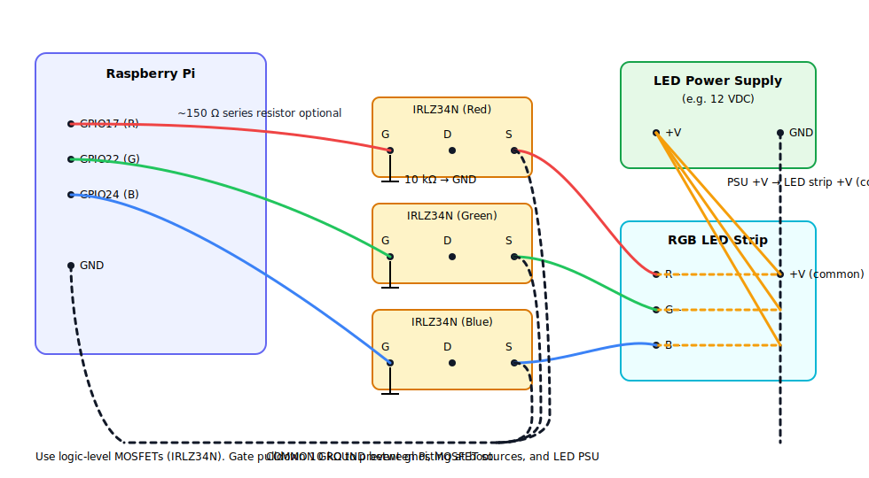

RGB LED Controller

A modern web-based RGB LED controller for Raspberry Pi.
Control RGB LED strips (via IRLZ34N MOSFETs on GPIO pins) from your phone or desktop browser with real-time updates, color presets, brightness, and fun effects like strobe and pulse.

The project consists of:

Node.js backend (Fastify + pigpio-client) to interface with the Pi’s pigpiod daemon.

Modern frontend UI (mobile-first, responsive, dynamic accent color) served from the same backend.

Real-time sync using Server-Sent Events (SSE) — no page reloads required.

Features

🎨 Color picker and RGB sliders

🌈 Preset swatches

💡 Brightness control

✨ Effects: strobe, pulse

🔄 Live updates (no page reloads)

📱 Responsive UI (works great on mobile portrait/landscape)

💾 Save & load scenes (stored locally in your browser)

Hardware Setup

Raspberry Pi (tested on Pi 3, works on others)

RGB LED strip

IRLZ34N MOSFETs (one per channel: R, G, B)

External power supply for the LED strip (common ground with Pi)

Wiring:

GPIO17 → Red MOSFET gate

GPIO22 → Green MOSFET gate

GPIO24 → Blue MOSFET gate

All grounds tied together

Software Setup (Raspberry Pi)
1. Update system
sudo apt-get update
sudo apt-get upgrade -y

2. Install pigpiod
sudo apt-get install -y pigpio
sudo systemctl enable --now pigpiod

3. Install Node.js (via NVM)
curl -o- https://raw.githubusercontent.com/nvm-sh/nvm/v0.39.7/install.sh | bash
export NVM_DIR="$HOME/.nvm"
source "$NVM_DIR/nvm.sh"

# Install a stable Node version
nvm install 14
nvm use 14

4. Clone the repo
git clone https://github.com/<your-username>/<repo-name>.git
cd <repo-name>

5. Install dependencies
npm install

6. Run the server
node server.js

Open your browser to:
http://<raspberry-pi-ip>:8080

Auto-start on Boot (systemd)

Create a service file:

sudo nano /etc/systemd/system/rgb-node.service

Paste:

[Unit]
Description=RGB LED Node Server
After=network.target pigpiod.service

[Service]
WorkingDirectory=/home/pi/<repo-name>
ExecStart=/bin/bash -lc 'source ~/.nvm/nvm.sh && nvm use 14 && node server.js'
Restart=always
User=pi
Environment=PORT=8080

[Install]
WantedBy=multi-user.target

Enable and start:

sudo systemctl daemon-reload
sudo systemctl enable --now rgb-node

## Wiring

- **GPIO17 → Red gate**, **GPIO22 → Green gate**, **GPIO24 → Blue gate**  
- **Gate pulldown:** 10 kΩ from each gate to GND (prevents random flicker at boot)  
- **Optional:** ~150 Ω series resistor between GPIO and each gate  
- **Drain → LED channel negative (R−/G−/B−)**  
- **Source → Ground**  
- **LED +V** from external PSU (e.g., 12 V) → LED strip +V (common)  
- **Common ground** between Pi GND, MOSFET sources, and PSU GND

Screenshots

(Insert your screenshots here — mobile + desktop views)

License

MIT License. See LICENSE
 for details.
